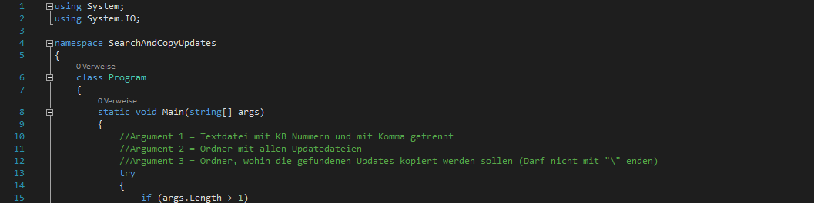

# Search & Copy Win Updates

  

## Inhalt
Hier finden Sie den Sourcecode für das Programm.

## Zweck
Beim Erstellen von aktualisierten Windows ISO's kommt es oft vor, dass man ein Ordner voller Updates hat, man aber nicht jedes davon integrieren möchte. Mit diesem Kommandozeilen Tool kann man anhand einer Liste genau die Updatedateien aussortieren lassen, die man braucht.
